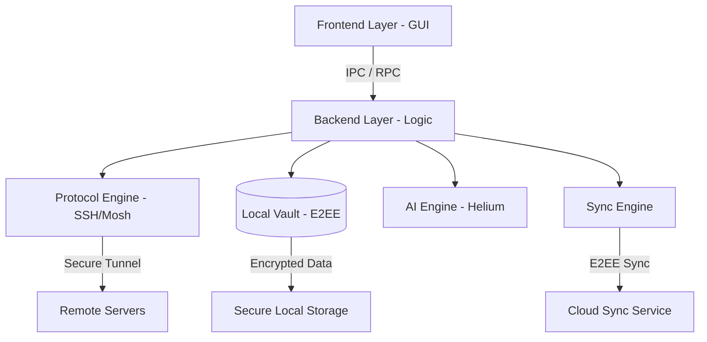

# System Architecture

Shellixa follows a multi-layered architecture designed for security, performance, and **seamless cross-platform portability**. While our initial release targets Linux, the core components are designed to run natively on Windows and macOS.

## Architecture Diagram

## Layers & Responsibilities

### 🎨 GUI Layer (PyQt)
-   **Tech Stack**: Python 3.x with **PyQt6/PySide6**.
-   **Goal**: Provide a native-feeling, high-performance interface for Linux desktops (KDE, GNOME, etc.).
-   **Responsibilities**: Orchestrating the Dashboard, Terminal tabs, and managing user interaction events.

### ⚙️ Backend Layer
-   **Tech Stack**: Node.js or Rust (Native Core).
-   **Goal**: Orchestrate the business logic of the application.
-   **Security**: Validates all requests from the UI before executing system-level commands.

### 🛡️ SSH Communication Layer
-   **Tech Stack**: libssh2 / ssh2 bindings.
-   **Goal**: Handle the complexities of the SSH protocol securely.
-   **Isolation**: Each connection runs in its own process or thread to prevent one failing session from crashing the entire app.

### 💾 Data Storage
-   **Tech Stack**: SQLite or encrypted JSON.
-   **Encryption**: At-rest encryption using AES-256 for sensitive fields.
-   **Structure**: Relational mapping for Hosts -> Groups -> Keys.

### 🔐 Security Components
-   **Master Password**: Optional encryption key for the local database.
-   **Host Verification**: Strict adherence to `known_hosts` standards to prevent MitM attacks.
-   **Isolation**: Memory-safe handling of private keys.

---

[← User Roles](04-user-roles.md) | [Index](README.md) | [Database Design →](06-database-design.md)
